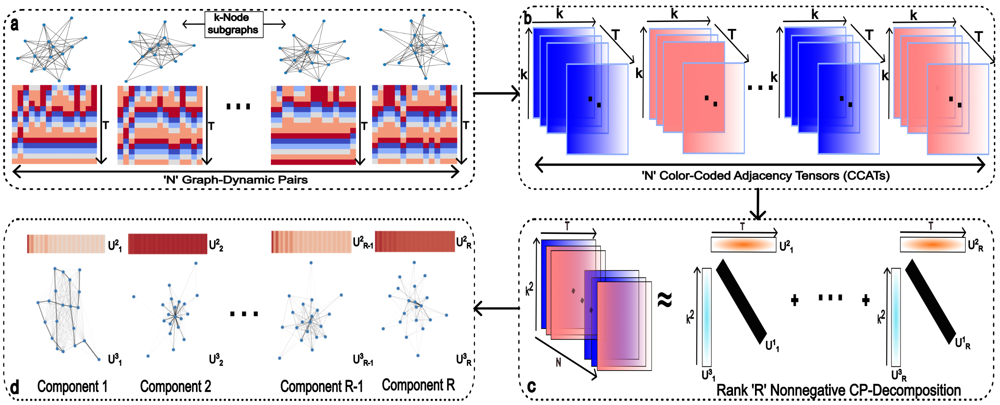

<h1 align="center">Nonnegative CP-Decomposition for Dynamical Systems</h1>

Agam Goyal1, Hanbaek Lyu2

1 Department of Computer Science,2 Department of Mathematics

University of Wisconsin - Madison

<!-- 

  

 -->

  

We propose to utilize an interpretable unsupervised feature extraction method of *nonnegative CP tensor decomposition* (NCPD) to extract key spatiotemporal patterns of emergence at subgraph level. That is, we first sample a large number of dynamics on medium-sized subgraphs and encode them as a three-dimensional tensor and then apply NCPD to learn a few snapshots of dynamics on certain subgraph patterns and their temporal evolution by using NCPD. We study the *firefly cellular automata* (FCA) of discrete pulse-coupled oscillators and *Hegselmann-Krause* (HK) model for opinion dynamics on synthetic networks generated by the Newman-Watts-Strogatz model and the Barabási-Albert (BA) networks. We demonstrate that our proposed method is able to key spatiotemporal patterns in these complex dynamics on networks. 
